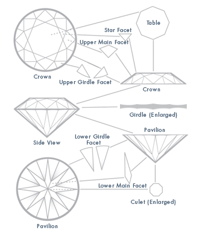

# Guide to Repackaging Content

By [Lex Joy](https://github.com/lex-joy)

# Introduction

This guide is intended to help Product Managers understand the concept of content repackaging, and provide examples of how it works.

Content repackaging helps Product Managers streamline their content production by either:

* Planning larger content projects with future social media posts in mind.
* Using smaller social media posts to build toward larger content in the future.

The proposed approach increases efficiency by allowing Product Managers to focus on their bigger projects while producing smaller social media content along the way, or to allow several smaller social media efforts to feed into larger content offerings.

By framing these content assignments as _related items_ rather than discrete projects, the approach reduces or eliminates the need to attend to many different projects at once. This saves Product Managers some time, energy, focus, and work.

<table>
  <tr>
   <td><strong>Note</strong>
   </td>
  </tr>
  <tr>
   <td> The strategies provided in this document are meant as suggestions, not mandates. Product Managers should use whatever methods they find most suitable for their work.
   </td>
  </tr>
</table>

# Visualizing content repackaging

Back in graduate school, I knew several professors and students who managed to publish far more than their peers. Despite having the same departmental obligations as everyone else (such as lesson planning, teaching, grading, and conducting research), the same skills, and the same 24 hours available each day, these exceptional performers nonetheless found the time to write and publish an astonishing number of papers, books, and other scholarly materials. What was their secret?

They worked _smarter_, not harder.

As it turned out, they all adhered to one simple method. They never wrote anything until they had mapped out future uses for it. In other words, everything they produced either **contained smaller work** or **built toward larger work**.

This is called **content repackaging**, and here are some of the ways this method would be put into practice:

* A graduate student would turn their final paper from each class into a publishable article or a chapter of their dissertation. After graduation, the dissertation would be made into a book, a series of published articles, or some combination of the two.
* A professor would write a series of related articles, publishing them individually. These publications would later become chapters in a book.
* A professor would release a book, then publish relevant excerpts in journals and reputable non-academic magazines.

In each example, the advantages of the method are obvious:

* **No wasted work**: Everything written is both an _end in itself_ and a _means for other projects_.
* **High-yield efforts**: The resources invested in a single project are also spent on other projects _at the same time_.

We can – and should – take advantage of this same procedure when generating our content. 

In our case, the content repackaging method is all about placing several key ideas in service of a single project, or recognizing that a larger project’s core ideas are viable small projects in themselves. In practice, our use of the content repackaging method would look something like this:

* Several smaller social media posts eventually lead to a full-length blog post.
* A sizable blog post or webinar becomes several smaller social media posts.

The rest of this document outlines the basics of the repackaging method, which you can use to gain the most mileage out of the content you create.

# The content repackaging process

The key to the content repackaging process is to remember that you are always working on **one single project**: a narrative around some aspect of your company's software or hardware ecosystem. The various media we employ are simply means to articulate that narrative.

I like to summarize the content repackaging approach through the phrase “**many facets, one jewel**.” There are many angles from which to view a cut gemstone. Each of them look different; each of them are appealing in and of themselves. Together, they form an entire jewel.[^1]

In the content repackaging process, your main narrative is the jewel. Your job for each social media post is to show only one facet of it.

The added bonus to this method is that it will help you tell a unified story about the project, resulting in a more consistent brand.

There are two possible approaches to content repackaging, which the remainder of this document describes in greater detail:

1. The **bottom-up approach** is for when you are starting a brand-new project, and do not have any pre-written content.
2. The **top-down approach** is for when you have larger content to hand already, and need to generate smaller supporting content.

## The bottom-up approach

This approach presumes that you are starting from scratch, and have no other content to hand. In this case, the most helpful approach is to start small, and build toward a larger project. Hence, we call it the “bottom-up approach,” as we are beginning from the lowest level of content and working toward the highest.

### Select your topic

First, decide on your topic. What are you going to write about? A product or feature? A newsworthy partnership? A design or governing philosophy of your company?

You can be as vague or specific in your selection as you like. The point of this step is simply to decide on a general direction for your content.

<table>
  <tr>
   <td><strong>Tip</strong>
   </td>
  </tr>
  <tr>
   <td>For help generating ideas for topics, consider this list of questions I made for designing exams. This isn’t an exhaustive or prescriptive list; it’s only meant to help provide ways to frame your thinking.

<strong>Product background</strong>
<ol>

<li>What role in the technological ecosystem is this product intended to fill?

<li>How does the product go about filling that role?

<li>How does the product work on a conceptual level?

<li>How does the product work on a granular level?

</ol>

<strong>Use cases</strong>
<ol>

<li>How would the user get started with using the product?

<li>What must the user know in order to make the product work as intended?

<li>What are some testing scenarios the user might try for the product?

<li>What are the most common tasks the user will perform when using the product?

<li>What are the most important tasks the user will perform when using the product?

<li>What are uncommon but necessary tasks the user will perform when using the product?

<li>What would a professional need to know about the product that a lower-level user (student, enthusiast, hobbyist) would not?

<li>What real-world scenarios call for this product? How would the user negotiate them?

</ol>

<strong>Integration with other products</strong>
<ol>

<li>What other offerings does the product support, if any?

<li>What must the user know to make the product work with other offerings?
</li>
</ol>
</li>
</ol>
</li>
</ol>
   </td>
  </tr>
</table>

### Identify main ideas

With a topic in hand, your next step is to identify the main ideas to convey about the topic. What needs to be said in order to tell its story? These essential narrative pieces are the topic’s main ideas.

A good rule of thumb for identifying the topic’s main ideas is to think about the **section headings** or **paragraph topic sentences** you might include in a long writeup about it. Each heading/topic sentence indicates something essential for your audience’s understanding, and therefore constitutes a serviceable main idea.

### Summarize main ideas

Next, collect your main ideas in a list. For each idea, write one or two concise sentences to summarize it.

Think of this as the “elevator pitch” for the idea. What is the key thing people need to know about it? Express this as quickly as possible in an easy-to-read sentence.

**If done correctly, each of these sentences can stand as a tweet or other brief social media message.**

### Develop main ideas

Now you can take the opportunity to elaborate on each of the summarized ideas. Add a few sentences to explain, clarify, or otherwise illuminate each idea.

Restrict your writing here to no more than a paragraph or two, making sure that what you produce is self-contained. In other words, someone should be able to read and understand it without needing additional context (though you can of course link them to other materials for further reading).

**If done correctly, each paragraph completed this way can function as a short- to medium-length social media post.**

### Organize main ideas

Your next task is to arrange the completed paragraphs in a coherent order.

Try to find the arrangement that “flows” the best by asking yourself the following questions:

* Which ideas are more basic? (Put these toward the beginning of the order.)
* Which ideas are more complex? (Put these later in the order.)
* Which ideas logically follow from one another? (Make sure these are sequential in your order.)

**If done correctly, the arranged paragraphs provide a rough draft of a longer blog post or webinar script.**

### Add missing information

All that remains is to turn the rough draft from the previous step into a presentable final product.

Assess what information is necessary to complete the writing by asking yourself the following questions:

* Do any paragraphs require additional details?
* Are additional supporting paragraphs necessary to complete my narrative?
* Do I need transition sentences to help the paragraphs flow?

Add this missing information to your draft as needed.

**If done correctly, the polished text forms a longer blog post, or provides the script for a webinar.**

### Sample process: MicroK8s

Let’s walk through how the bottom-up approach might look, using [MicroK8s](https://microk8s.io/) as our focus.

#### Selecting a topic

Which aspect of MicroK8s should we discuss? For this exercise, let’s home in on some use cases:

* What real-world scenarios call for this product?
* How would the user negotiate them?

We already have a terrific blog post on a similar topic (“[What can you do with MicroK8s?](https://ubuntu.com/blog/what-can-you-do-with-microk8s)” by Anastasia Valti), so we’re going to try a slightly different approach here.

#### Identifying main ideas

Now that we’ve settled on our topic, we need to figure out our main ideas. Let’s list a few of the major things you can do with MicroK8s:

* [Set up a GitLab CI/CD pipeline](https://ubuntu.com/tutorials/gitlab-cicd-pipelines-with-microk8s#1-overview).
* Make a Kubernetes cluster on pretty much any device.
* Run edge applications.

We can discuss how the user would make these happen at a later point. For now, we only need a handful of examples.

#### Summarizing main ideas

Next, we need to summarize the point behind these ideas in a sentence or two. Ideally, this will fit the length of a tweet or other short-form social media post – meaning that we’ll have produced social media content as a natural part of our process!

Here are some possible summaries for our main ideas:

* You can integrate MicroK8s and GitLab to create a small, low-maintenance way to build, test, and deploy your projects.
* MicroK8s has such a small footprint that you can put a Kubernetes cluster on nearly anything.
* The efficiency of MicroK8s makes it ideal for running edge applications.

#### Developing main ideas

Each of the summaries you’ve written provides the topic sentence for a paragraph. If we add a few sentences to expand upon them – to the point where we have a self-contained paragraph or two – we’ll end up with a short- to medium-length social media post.

Don’t hesitate to change the wording of your original summary for greater readability.

Let’s put together some simplified examples using the summaries we wrote earlier:

* You can integrate MicroK8s and GitLab to create a small, low-maintenance way to build, test, and deploy your projects. With Juju, GitLab, and MicroK8s installed on your machine, all you need to do is add your MicroK8s-deployed Kubernetes cluster to your GitLab project and configure the pipeline. It won’t be long before you have a fully functional CI/CD pipeline at your disposal.
* MicroK8s has such a small footprint that you can put a Kubernetes cluster on nearly anything. Launch it from your desktop with a single terminal command. Run it on a virtual machine for a resource-efficient development container. Put it on a Raspberry Pi for a scalable, production-grade cluster. With hardware limitations minimized, the only constraint is your imagination.
* The efficiency of MicroK8s makes it ideal for running edge applications. In distributed systems, MicroK8s brings the containerizing and computational power of Kubernetes to where it’s needed most. MicroK8s ensures that data can be stored and processed in all manner of devices – including those closest to the edge.

<table>
  <tr>
   <td>
<strong>Note</strong>
   </td>
  </tr>
  <tr>
   <td>The paragraphs provided here would need a little bit of work before they could stand as social media posts, because the point of this example is only to demonstrate the method.
   </td>
  </tr>
</table>

#### Organizing main ideas

Now our aim is to string these developed ideas together to form a cohesive narrative.

Think back to the topic we selected at the outset. The chosen topic defines the story we are trying to tell. We decided that we want to show a few real-world uses for MicroK8s.

In this case, a good narrative arc would be to move from the least complex idea to the most complex idea. We can start with the freedom of running MicroK8s anywhere, which is broad, basic, and conceptually simple. Then we can advance to the more particular kinds of applications readers might consider, which asks readers to think more concretely. We can conclude with a specific and somewhat complex individual project they might pursue.

With this in mind, we can organize the developed ideas as follows:

* MicroK8s has such a small footprint that you can put a Kubernetes cluster on nearly anything. Launch it from your desktop with a single terminal command. Run it on a virtual machine for a resource-efficient development container. Put it on a Raspberry Pi for a scalable, production-grade cluster. With hardware limitations minimized, the only constraint is your imagination.
* The efficiency of MicroK8s makes it ideal for running edge applications. In distributed systems, MicroK8s brings the containerizing and computational power of Kubernetes to where it’s needed most. MicroK8s ensures that data can be stored and processed in all manner of devices – including those closest to the edge.
* You can integrate MicroK8s and GitLab to create a small, low-maintenance way to build, test, and deploy your projects. With Juju, GitLab, and MicroK8s installed on your machine, all you need to do is add your MicroK8s-deployed Kubernetes cluster to your GitLab project and configure the pipeline. It won’t be long before you have a fully functional CI/CD pipeline at your disposal.

Lo and behold! We now have the rough draft of a long-form project, like a blog post or a webinar script.

#### Adding missing information

All that remains is to patch our paragraphs together so that we have a functional draft for a longer piece. We’ll still have to polish things a little, but we’ve done all the heavy lifting. With an introduction, a few transition sentences, some rewording as needed, and a closing remark, we’ll have our completed draft.

Let’s make a first attempt using our rough draft from the previous step:

> By now, you’ve probably heard of [MicroK8s](https://microk8s.io/), Canonical’s versatile zero-ops Kubernetes. There’s no shortage of documentation explaining how MicroK8s works and how to set it up. But you might be wondering what some of the real-world applications of MicroK8s could be. We have a few ideas for you!
>
> For starters, MicroK8s has such a small footprint that you can put a Kubernetes cluster on nearly anything. Launch it from your desktop with a single terminal command. Run it on a virtual machine for a resource-efficient development container. Put it on a Raspberry Pi for a scalable, production-grade cluster. With hardware limitations minimized, the only constraint is your imagination.
>
> Some of the cleverest uses of MicroK8s take advantage of these minimal limitations. For example, the efficiency of MicroK8s makes it ideal for running edge applications. In distributed systems, MicroK8s brings the containerizing and computational power of Kubernetes to where it’s needed most. MicroK8s ensures that data can be stored and processed in all manner of devices – including those closest to the edge.
>
> How about putting these principles to use with a small project of your own that you can start today? You can integrate MicroK8s and GitLab to create a small, low-maintenance way to build, test, and deploy code. With Juju, GitLab, and MicroK8s installed on your machine, all you need to do is add your MicroK8s-deployed Kubernetes cluster to your GitLab project and configure the pipeline. (We have a [detailed tutorial](https://ubuntu.com/tutorials/gitlab-cicd-pipelines-with-microk8s#1-overview) available.) It won’t be long before you have a fully functional CI/CD pipeline at your disposal.
>
> We’ve barely covered the many possibilities of MicroK8s. There are plenty of MicroK8s projects out in the world today, and new applications are discovered all the time. We look forward to seeing the exciting things you’ll do with it!

The draft above still needs a little bit of work to meet your company's quality standards. (Blame the deadline I’m currently battling!) However, as you can see, the content repackaging method has allowed us to produce multiple strains of usable content while generating this draft – _without_ having to do extra work outside the usual writing process.

## The top-down approach

This approach presupposes that you have a larger content project to hand already (like a webinar, report, whitepaper, or lengthy blog post), and now must generate smaller supporting content for it. Hence, we call it the “top-down approach,” since we’re starting from the heights of a large project and working down to its smaller constituent parts.

In the top-down approach, the work is _already done_ – you simply need to repackage it.

### Select an existing project

This is the easy part! Pick a longer piece of content that has already been completed, but that needs supporting social media content.

Good starting points include:

* Longer blog posts
* Webinars
* Reports
* Whitepapers

### Identify main ideas

Next, identify the main ideas the project conveys about its chosen topic. What does the project say in order to tell its topic’s story? The points marshaled in service of this narrative are the project’s main ideas.

A good rule of thumb for identifying main ideas is to focus on the **section headings** or **paragraph topic sentences** included in the project. Each heading/topic sentence indicates something essential for the audience’s understanding, and therefore constitutes a main idea.

### Summarize main ideas

Next, collect the main ideas in a list. For each idea, write one or two concise sentences that summarize it.

Think of this as the “elevator pitch” for the idea. What is the key thing people need to know about it? Express this as quickly as possible in an easy-to-read sentence.

**If done correctly, each of these sentences can stand as a tweet or other brief social media message.**

### Develop main ideas

Now you can take the opportunity to elaborate on each of the summarized ideas. Add a few sentences to explain, clarify, or otherwise illuminate each idea.

Restrict your writing here to no more than a paragraph or two, making sure that what you produce is self-contained. In other words, someone should be able to read and understand it without needing additional context (though you can of course link them to other materials for further reading).

<table>
  <tr>
   <td><strong>Tip</strong>
   </td>
  </tr>
  <tr>
   <td>If you found that brevity forced you to cut details from your summary, now is your opportunity to reintroduce them.
   </td>
  </tr>
</table>

**If done correctly, each paragraph completed this way can function as a short- to medium-length social media post.**

### Sample process: OpenStack

Let’s walk through how the top-down approach might look, using [OpenStack](https://www.openstack.org/) as our focus.

#### Selecting an existing project

First, we’ll need to choose a project that already exists.

Canonical’s [OpenStack page](https://ubuntu.com/openstack) is a good place to begin. On the bottom-right of the page, you’ll find a list of recent blog posts about OpenStack. Any one of these could serve as a starting point.

For the purposes of this sample, we’ll use Omar Amin Emam’s  “[Kubernetes Fully Managed – half the cost of AWS](https://ubuntu.com/blog/managed-kubernetes-cheaper-than-aws),” which I’ve selected at random from the list of available posts.

#### Identifying main ideas

Our author does a good job of highlighting his main ideas, thanks to his concise and informative section headings. Let’s transcribe the headings here, and include alternative phrasings so that we can be more explicit about the ideas behind them:

1. **AWS – the leading public cloud provider** – Amazon currently dominates the cloud infrastructure and platform services spaces.
2. **Why AWS EKS?** – The reasons one might adopt Amazon’s Elastic Kubernetes Service.
3. **What to consider?** – The factors one should consider when determining which Kubernetes service/provider to bring into your workplace.
4. **Managed Kubernetes: AWS EKS vs Canonical** – A comparison of the prices, features, and advantages of AWS EKS and Canonical.
5. **Conclusion** – Canonical’s Kubernetes offerings are better than the competition’s.

#### Summarizing main ideas

Now, let’s take each of these main ideas, and write a brief, one- or two-sentence summary of their key points. The objective is to go a step further than restating the idea. We want to give a bite-sized version of the argument we make in each point (or hint at the argument we’re implicitly making):

1. **AWS – the leading public cloud provider** – Amazon is the leading provider of Kubernetes services, thanks to 11 years in the market. (But are there superior competitors?)
2. **Why AWS EKS?** – Amazon offers over 200 reasonably-priced EKS products and services. (But your organization needs some expertise to use them effectively.)
3. **What to consider?** – Do the hidden costs and tradeoffs of AWS EKS make it worthwhile for your organization? Canonical’s managed Kubernetes might be more suitable.
4. **Managed Kubernetes: AWS EKS vs Canonical** – Canonical’s smart pricing models make its Kubernetes offerings a much better value than AWS EKS in many cases.
5. **Conclusion** – There are advantages to both AWS EKS and Canonical’s managed Kubernetes, but Canonical’s are probably right for you.

#### Developing main ideas

Each of the main ideas we’ve summarized can be expanded into its own small social media or blog post. For the purposes of this exercise, we’ll develop only one of them, as it will be enough to illustrate the method.

All we need to do is elaborate on the idea by adding explanations, clarifications, supporting facts, examples, and your copywriting flair. You can also take this opportunity to add all the things you had to cut out of your summary.

Let’s use the “What to consider?” idea. Here are the beginnings of a possible post made from the material we’ve gathered:

> Do the hidden costs and tradeoffs of AWS EKS make it worthwhile for your organization? AWS EKS boasts a competitive price of only $73 USD per cluster per month, which no other service provider can match. It also takes on the burden of keeping your Kubernetes cluster running, which frees your precious time so you can focus on the rest of your business. Still, AWS EKS doesn’t do _everything_ – and those gaps could cause your organization headaches.
> 
> For starters, Kubernetes upgrades on AWS EKS are not fully automated. This means that they require manual intervention and expertise from within your organization. Unfortunately, upgrading Kubernetes is challenging, time-consuming, and risky! AWS EKS provides some automation to help with the upgrade process, but it doesn’t eliminate your personnel requirements.
> 
> [And so on, and so forth, culminating in a conclusion that Canonical’s managed Kubernetes addresses all these issues…]

## Notes

[^1]: Image: Verena Pagel-Theisen, _Diamond Grading ABC: Handbook for Diamond Grading_, 1980 (p.154).
